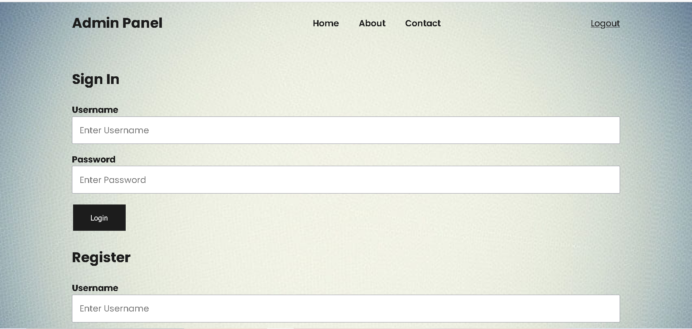
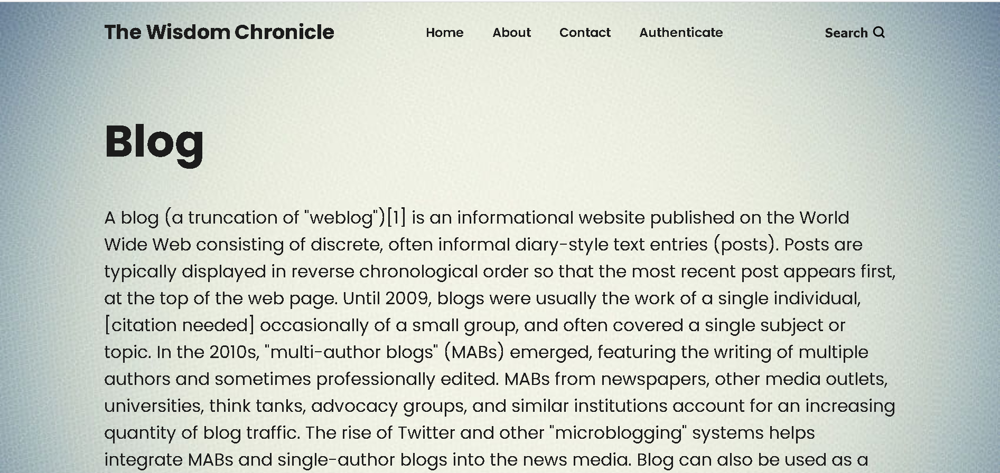
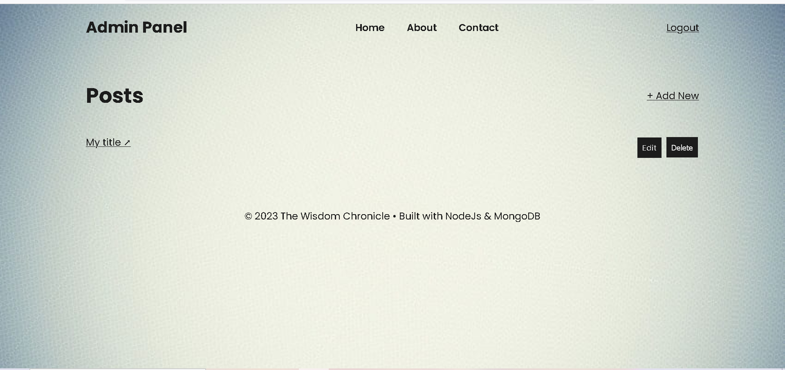
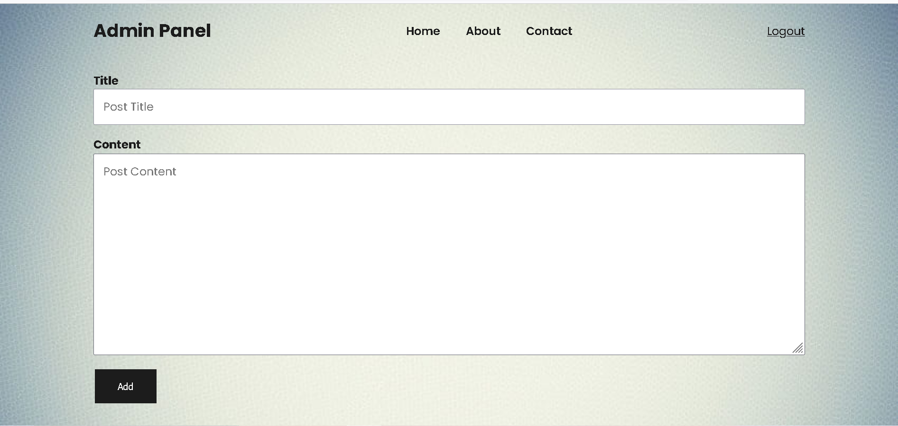

# Blog-project

This application allows authenticated user to read and post blogs.
User can also edit and delete their previous blogs.

## Tech Stack

- Node.Js
- Database : MongoDB

## Screenshots

---

#### Home Page

---

#### Login Page

---

#### View Blog

---

#### Admin Dashboard

---

####  Add blog

